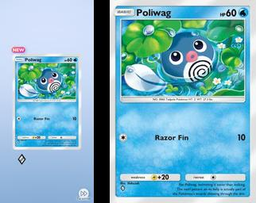
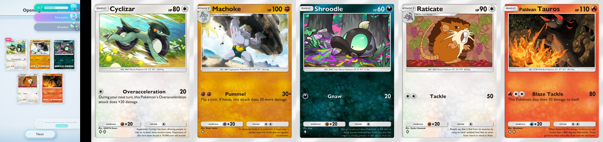
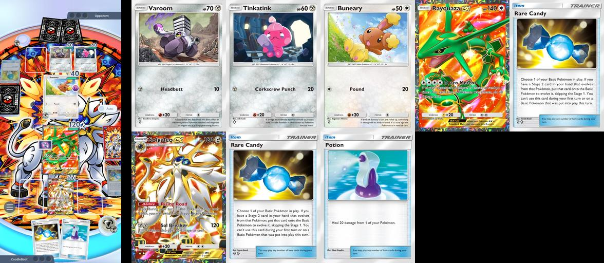
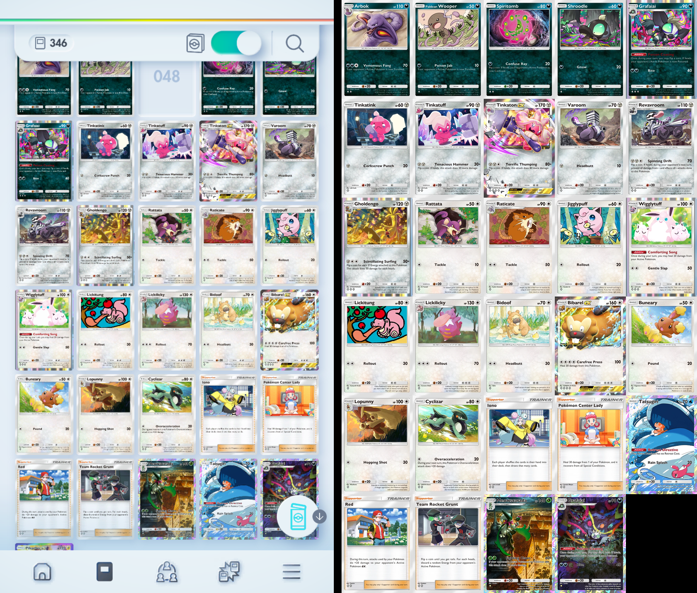

# 🃏 Pokemon TCG Pocket Card Detection

## 📋 Table of Contents

- [Project Summary](#-project-summary)
- [Overview & Examples](#-overview--examples)
- [Repository Setup Guide (WIP)](#-repository-setup-guide-wip)
- [Extra Notes](#-extra-notes)

## 🚀 Project Summary

This repository implements a **high-performance Pokemon TCG Pocket card detection and classification pipeline** for real-time screenshot and video input.
The workflow is fully asynchronous and optimized for speed, accuracy, and scalability.

> _Future plans to expand to the full **Pokemon TCG**._

## 📸 Overview & Examples

### 1. Screenshot/Video Ingestion

- Screenshots are pulled from `screenshot_dir` and videos from `videos_dir` (configurable in `config.yaml`).
- Asynchronous pipeline ensures frame acquisition never blocks processing.



_Example: Pack Opening Screenshot_


_Example: Pack Opening Video Demo_

---

### 2. YOLOv8 Detection & Tracking

- YOLOv8 identifies cards in each frame, outputting bounding boxes, scores, and class labels (“fullart” vs. “standard”).
- Integrated ByteTrack/SORT assigns persistent `track_id`s for robust tracking. _(TODO)_



_Example: Pack Summary Screenshot_


_Example: Dex Scrolling Video Demo_

---

### 3. Fast Duplicate Filtering (pHash Cache)

- Each crop is hashed with a 64-bit perceptual hash (`pHash`).
- Store a configurable amount of crops in the hash.
- If the newly detected crop matches a hashed crop (given the conifgurable hamming distance), we skip classificaiton

---

### 4. Pruned, Quantized & Distilled CNN Classification

- Uncached crops are classified by fast, mobile-ready student CNNs.
- Models distilled from EfficientNet-B0, then pruned and quantized for sub-10 ms inference. _(TODO)_

---

### 5. Asynchronous, Pipelined Architecture

- Detection (YOLO) and classification (CNN) run in parallel streams.
- A thread-safe queue decouples detection/classification.
- Adaptive batching and buffer limits keep the system responsive, even with many cards.

---

### 6. Configuration & Testing

- Configs (`config.yaml`, `tests.yaml`, etc) are located in `configs/`.
- The `videos`, `screenshots` and expected output (`fixtures`) files for tests reside in `data/`.
- `Makefile`, `pytest`, and `requirements.txt` automate setup and CI/CD.

---

### 7. Future Directions

- [x] ~~YOLO tracking~~ (Resource intensive, no gain)
- [x] Percuptual Hashing
- [ ] Distilation and pruning of models
- [ ] Automated ingestion for new expansion pack
- [ ] Continuous benchmarking to maintain <100ms end-to-end latency at high card counts
- [ ] Mobile model optimization (TinyML)

---

### 📷 Other Visual Examples



_Battle Screenshot_



_Card Dex Screenshot_

## 📁 Repository Setup Guide (WIP)

> **This guide describes how to configure, structure, and use this repo.** > _WIP: Feedback and edits welcome!_

### 1. Prerequisites

---

- Python ≥ 3.12
- `git` (for cloning, version control)

#### Install PyTorch with CUDA (if you have an NVIDIA GPU)

Go to [PyTorch Get Started](https://pytorch.org/get-started/locally/) and select your CUDA version.
Example for CUDA 12.1:

```sh
# Determine cuda version (see top right of output)
nvidia-smi

# If cuda is avaliable (example, copy from pytorch website)
pip install torch torchvision --index-url https://download.pytorch.org/whl/cu121

# If cuda is not avaliable, or if unsure
pip install torch torchvision
```

### 2. Installation

---

```bash
# Clone the repository
git clone https://github.com/OctalDecoder/pokemon-tcg-card-detector.git
cd pokemon-tcg-card-detector

# Install the requirements
pip install -e .
```

### 3. Screenshots & Videos

---

- Place images to be processed in:
  `data/screenshots/`
- Place videos to be processed in:
  `data/videos`
- **To change these locations:**
  Edit `config.yaml` → `shared` → `screenshot_dir` or `video_dir`.

### 4. Data & Intermediate Model Files

---

- TCG card images used for training are to be placed in:
  `data/data_gen/cards/`
- All temporary checkpoints, embeddings, and intermediate files are created in:
  `data/`

### 5. Database Setup

---

> TODO: Rework this section

- **Download or obtain** the database (`cards.db`) from \[TBD download link or instructions].
- Place it in:
  `models/cards.db`
- **To change this location:**
  Edit `config.yaml` → `shared` → `database`

### 6. Configuration Structure

---

- The main configuration file is `config.yaml`.
- The `shared` section merges into all other config sections:

  - _Best practice_: Use `shared` for common variables.
  - **Override priority:**
    `shared` values are populated into all other sections. These individual config sections (e.g., `yolo`, `cnn`) take precedence over `shared` for conflicting values.

### 7. Card Image Directory & Naming Convention

---

> **Card images of high quality should be labelled and stored here for model training.**

- **Base directory:**
  Controlled by `config.yaml` → `shared` → `card_images_dir`
- **Class subfolders:**
  Must match names in `config.yaml` → `shared` → `classifiers` (e.g., `fullart`, `standard`)
- **File naming:**
  Place images inside the relevant classifier subfolder, named as `[SeriesID] [CardID].png`

**Example** (for `card_images_dir: data/raw/cards`, `classifiers: fullart, standard`):

```
data/raw/cards/standard/A2b 32.png
data/raw/cards/fullart/S5 100.png
```

> Note: These subfolders represent the `yolov8n` model detection labels. Can have as many as needed so long as they are organised and configured. The project is set up to automatically train `student CNN` models, one per detection label.

### 8. Output Directories

---

- By default, processed images, results, generated data, trained models, and test runs are saved to:

  - Output dir specified in `config.yaml` → `shared` → `output_dir`

- Subdirectories (e.g., `output/yolo/`) are automatically created as needed.

### 9. Running the Pipeline

---

The following commands are provided for convinience, use the `--help` tag for more information

```bash
# --- FULL ---
card-detector detect --help
card-detector train --help

# Process screenshots
card-detector detect
# Process videos
card-detector detect --v
# Process videos headless
card-detector detect --v -hl

# --- ALIAS ---
cdt detect --help
cdt train --help
```

### 10. Work-in-Progress Notes

---

> To comply with the Pokémon TCG Pocket Terms of Use, this project does not include or distribute any official game assets. Users must obtain their own card data and images from within the game.

- Documentation is evolving; structure and locations may shift.
- Please keep `config.yaml` and directory structure updated if you move or rename files.

---

### ⚡ Quick Reference

| Purpose                   | Path              | Config Key               |
| ------------------------- | ----------------- | ------------------------ |
| Test images (screenshots) | `tests/fixtures/` | `shared.screenshot_dir`  |
| Raw card images           | `data/raw/cards/` | `shared.card_images_dir` |
| Database file             | `models/cards.db` | `shared.database`        |
| Output/results            | `output/`         | `shared.output_dir`      |

> By combining **pHash caching**, **pruned+quantized distilled CNNs**, and an **asynchronous pipelined architecture**, we'll minimize redundant CNN inferences, squeeze maximum throughput out of the GPU, and aim to keep peak frame time under ~100 ms even when dozens of cards appear simultaneously.

## License

This project is licensed under the [MIT License](LICENSE).

The MIT License permits use, modification, and distribution of this software, including for commercial purposes, provided the original copyright notice and license text are included.

By using or contributing to this project, you agree to comply with the terms of the MIT License.

---

For any questions about licensing or contributions, please contact the project maintainers.
